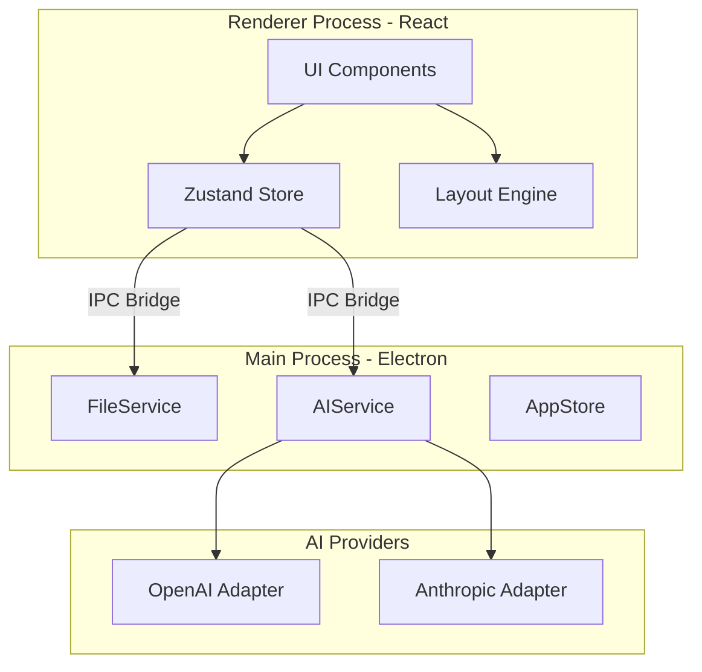

# base灵感搜索树 (IST) MVP 技术方案

## 技术栈推荐

### 桌面框架

- **Electron** (v33+) -- 用户确认选型，JS 全栈生态成熟
- **electron-builder** -- 打包分发 Mac/Windows

### 前端

- **React 19 + TypeScript** -- 主 UI 框架
- **Vite** -- 构建工具，搭配 `electron-vite` 实现快速开发
- **Zustand** -- 轻量状态管理，管理树数据、UI 状态
- **Tailwind CSS v4** -- 样式方案

### 画布渲染（XMind 风格）

- **自定义 SVG 渲染** -- 使用 React 组件渲染节点 + SVG path 绘制弧形连线
- **react-zoom-pan-pinch** -- 画布平移/缩放交互
- **自定义布局算法** -- 实现 idea.md 中描述的特定排列规则（灵感节点右展、实验节点下排）

> 不使用 React Flow 的原因：React Flow 偏向自由连线的节点图风格，要实现 XMind 风格的自动布局和弧形分支线需要大量 hack，不如直接自定义 SVG 来得灵活。

### AI 集成

- 全部使用 TypeScript 实现，MVP 直接使用 **OpenAI SDK** (`openai`) 和 **Anthropic SDK** (`@anthropic-ai/sdk`)
- AI 调用在 Electron **主进程** 中执行，避免暴露 API Key
- 通过统一的 `AIService` 接口抽象，后期可替换/扩展其他提供商而不影响业务逻辑
- 用户可自定义三项配置：**Base URL**（API 端点）、**Model**（模型名称）、**API Key**
- **electron-store** -- 持久化存储上述配置
- Prompt 调试可直接在 Electron DevTools 控制台中完成

> 自定义 Base URL 的好处：用户可以指向 OpenAI 兼容的第三方服务（如 DeepSeek、本地 Ollama、各类中转站等），无需修改代码。

### 文件格式

- MVP 阶段：**JSON 文件 + .ist 扩展名**
- 后期演进：采用 **ZIP 容器格式**（类似 .docx），内含 `tree.json` + `assets/` 目录，支持图片和附件

---

## 解耦架构设计

各功能模块通过明确的接口边界解耦，确保可独立开发、测试和替换：




关键解耦边界：

- **UI 层 vs 数据层**：React 组件只负责渲染和交互，所有数据操作通过 Zustand Store
- **Store vs 布局引擎**：布局算法是纯函数 `(tree) => positions`，不依赖任何 UI 或 Store
- **渲染进程 vs 主进程**：通过 IPC Bridge（preload 暴露的类型安全 API）通信，渲染进程不直接访问文件系统或网络
- **AI 服务抽象层**：统一的 `AIService` 接口，OpenAI/Anthropic 作为可插拔的 Adapter 实现
- **文件服务抽象层**：统一的 `FileService` 接口，隔离序列化格式细节，后期切换 ZIP 格式无需改动上层

## 项目结构

```
ist-app/
├── electron/                # Electron 主进程
│   ├── main.ts             # 主进程入口
│   ├── preload.ts          # preload 脚本（类型安全的 IPC bridge）
│   ├── services/
│   │   ├── ai/
│   │   │   ├── AIService.ts        # AI 服务统一接口
│   │   │   ├── OpenAIAdapter.ts    # OpenAI 适配器
│   │   │   └── AnthropicAdapter.ts # Anthropic 适配器
│   │   └── file/
│   │       ├── FileService.ts      # 文件服务接口
│   │       └── JsonFileAdapter.ts  # JSON 格式实现（MVP）
│   ├── ipc/                 # IPC 处理器（路由层，调用 services）
│   │   ├── fileHandlers.ts
│   │   └── aiHandlers.ts
│   └── store.ts             # electron-store（用户设置持久化）
├── src/                     # 渲染进程（React）
│   ├── App.tsx
│   ├── components/
│   │   ├── Canvas/          # 画布组件
│   │   │   ├── Canvas.tsx           # 主画布容器（zoom/pan）
│   │   │   ├── TreeRenderer.tsx     # SVG 树渲染
│   │   │   ├── IdeaNode.tsx         # 灵感节点（黄色）
│   │   │   ├── ExperimentNode.tsx   # 实验节点（灰色）
│   │   │   └── ConnectionLine.tsx   # 弧形连接线
│   │   ├── Sidebar/
│   │   │   └── NodeDetail.tsx       # 右侧节点详情面板
│   │   ├── Welcome/
│   │   │   └── WelcomePage.tsx      # 欢迎页（新建/打开）
│   │   └── Settings/
│   │       └── AISettings.tsx       # AI 配置页面
│   ├── layout/
│   │   └── treeLayout.ts   # 纯函数布局算法（无副作用）
│   ├── store/
│   │   ├── useTreeStore.ts  # 树数据状态
│   │   └── useUIStore.ts   # UI 状态（选中节点、面板开关等）
│   ├── types/
│   │   └── ist.ts           # IST 数据类型定义（主进程/渲染进程共享）
│   ├── bridge/
│   │   └── ipc.ts           # 封装 preload API 的类型安全调用
│   └── hooks/
│       ├── useFileOps.ts    # 文件操作 hook（调用 bridge）
│       └── useAI.ts         # AI 操作 hook（调用 bridge）
├── shared/                  # 主进程和渲染进程共享的类型/常量
│   └── types.ts
├── package.json
├── electron-builder.yml
└── vite.config.ts
```

---

## 核心数据模型

```typescript
interface ISTProject {
  version: string;
  rootNodeId: string;
  nodes: Record<string, ISTNode>;
  meta: { createdAt: string; updatedAt: string; };
}

interface ISTNode {
  id: string;
  type: 'idea' | 'experiment';
  title: string;
  description: string;
  parentId: string | null;
  childrenIds: string[];       // 有序，决定排列顺序
  createdAt: string;
  updatedAt: string;
  // 未来扩展
  gitBranch?: string;
  experimentResult?: string;
}
```

---

## 布局算法核心逻辑

根据 idea.md 第 4-6 条规则，对所有灵感节点（包括根节点）统一适用以下布局规则：

- **实验子节点**：在父灵感节点的**正下方**垂直排列，由灰色弧形连线连接
- **灵感子节点**：在父灵感节点的**右侧**排列，由黄色弧形连线连接

示意图：

```
  Root (idea, yellow)
    │ grey, downward         ───► yellow, rightward
    ├─ Experiment A                Child Idea 1 (yellow)
    ├─ Experiment B                  │ grey, downward
    │                                ├─ Exp 1-A
    │                                ├─ Exp 1-B
    │                                │
    │                                ───► Child Idea 1-1 (yellow)
    │
    │                          Child Idea 2 (yellow)
    │                                ───► Child Idea 2-1 (yellow)
```

更精确的二维坐标示意（注意连线归属）：

```
  [Root] ──┬──── [Child Idea 1] ──── [Child Idea 1-1]
    |      │          |
  [Exp A]  │      [Exp 1-A]
    |      │          |
  [Exp B]  │      [Exp 1-B]
           │
           └──── [Child Idea 2] ──── [Child Idea 2-1]
```

注意：Child Idea 1 和 Child Idea 2 都由黄色连线从 Root 分支出来（┬/└ 表示分支），
而非 Child Idea 2 连接在 Exp 1-B 下方。实验节点（Exp A/B）由灰色连线从 Root 向下延伸（|）。

排列规则（对任一灵感节点的子节点列表）：

1. 灵感子节点在父节点**右侧**从上往下依次排列
2. 每个灵感子节点的**实验子节点**紧跟在该灵感子节点下方排列
3. 排完一个灵感子节点及其所有实验子节点后，再排下一个灵感子节点
4. 父节点自身的实验子节点直接排在父节点**正下方**，位于灵感子节点列的左侧

连线样式：

- 连线颜色：黄色（灵感→灵感），灰色（灵感→实验）
- 连线形状：贝塞尔曲线（cubic bezier），类似 XMind

布局使用递归算法，自底向上计算每个子树占据的高度，然后自顶向下分配坐标。

---

## AI 功能（MVP）

1. **一键生成标题**：用户填写描述后，调用 LLM 生成简短标题
2. **一键总结**：汇总从根节点到当前灵感节点的路径 + 所有子节点信息，生成摘要
3. **AI 配置页面**：选择提供商（OpenAI / Anthropic）、填写 Base URL、API Key、Model 名称

AI 服务接口设计（便于后期扩展）：

```typescript
interface AIService {
  generateTitle(description: string): Promise<string>;
  summarize(context: SummarizeContext): Promise<string>;
}

interface SummarizeContext {
  pathFromRoot: ISTNode[];
  subtreeNodes: ISTNode[];
}
```

MVP 提供两个 Adapter：`OpenAIAdapter`、`AnthropicAdapter`，通过用户设置动态切换。

---

## 已确认的设计决策

1. **保存方式**：手动保存（Cmd+S / Ctrl+S），符合 XMind/PPT 使用习惯
2. **启动流程**：自动打开上次关闭时的工程；首次使用或无历史时显示欢迎页（新建/打开）
3. **AI 提供商**：MVP 直接集成 OpenAI 和 Anthropic SDK，后期重构为可扩展架构
4. **节点标题宽度**：设置最大宽度（约 300px），超出部分省略号截断
5. **画布缩放范围**：25%-400%
6. **删除子树**：有子节点的节点删除时，整棵子树一并删除（弹窗确认后执行）

---

## 开发阶段划分

### Phase 1: 项目脚手架 + 基础画布

搭建 Electron + React + Vite 项目，实现画布的平移/缩放，渲染静态的示例树

### Phase 2: 树数据管理 + 节点操作

实现 Zustand store、节点增删、布局算法、动态重排

### Phase 3: 节点交互 + 侧边栏

点击选中节点、右侧信息栏编辑标题/描述、删除确认弹窗

### Phase 4: 文件管理

.ist 文件的保存/打开、Electron 菜单栏（新建/打开/保存）、文件关联

### Phase 5: AI 功能

API 配置页面、一键生成标题、一键总结

### Phase 6: 打包分发

electron-builder 配置 Mac/Windows 打包、.ist 文件类型关联