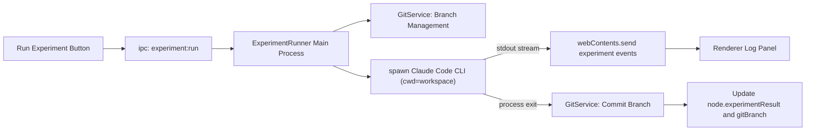

# IST 自动化实验 MVP 工作计划

## 设计原则
代码尽量精简，只做打通自动化实验闭环的最小集；IST 应用实现不引入 Python、不做审批门、不做多 harness、不做撤销重做。所有新增逻辑复用现有 Electron 主进程/IPC/Zustand 结构。

## 核心方法论（借鉴 DeepScientist，原生 TS 重写）
- **不自建 harness**：把 Claude Code CLI 当子进程无头调用，流式读取 stdout 事件（参考 `DeepScientist-1.6.0/src/deepscientist/runners/simple_cli.py` 的 spawn+流式+收尾模式，以及 `DeepScientist-1.6.0/src/deepscientist/runners/claude.py` 中的 `claude -p --input-format text --output-format stream-json --verbose` 形态）。
- **一工程一仓库，一实验一分支**：用 `git` 命令管理工作区，每个实验节点派生一个 branch（参考 `gitops/service.py` 的 `ensure_branch`/`checkpoint_repo`）。
- **文件化轨迹**：运行日志落盘到工作区，便于人类查看/接管。

## Claude Code CLI 可行性确认
- DeepScientist 已有 `ClaudeRunner`，不是文档占位；其核心链路包含 runner 注册、daemon/CLI 实例化、默认配置、doctor probe 与测试覆盖。
- 关键实现依据：`ClaudeRunner._command_uses_stdin_prompt()` 返回 `true`，`SimpleCliRunner.run()` 将 prompt 写入 stdin，避免长 prompt 进入 argv；stdout 逐行读取并按 JSON 解析。
- MVP 采用的最小命令形态：`claude -p --input-format text --output-format stream-json --verbose --add-dir <workspace> --no-session-persistence --permission-mode bypassPermissions`。
- DeepScientist 的 `--mcp-config`、`--allowedTools`、`--disallowedTools` 是为了注入其内置 MCP 工具；IST MVP 暂不复制这部分，先使用 Claude Code 原生文件/命令能力在本地工作区执行实验。
- 运行前 smoke check：`claude -p "Reply with exactly HELLO." --output-format json --tools ""`，用于确认本机 Claude Code 已安装并完成登录鉴权。

## 工程 ↔ 工作区映射
- `.ist` 仍是 JSON，新增 `meta.workspacePath`（相对/绝对路径）。
- 工程旁关联一个工作区文件夹（git 仓库）；首次运行实验时若无则 `git init`，main 分支为基线。
- 用户可把数据集/baseline 代码放入工作区根目录。
- MVP 测试固定使用仓库新增的 `data/cal_housing.csv`（California Housing 样例数据集）。首次端到端 demo 时，将该文件作为工作区 `data/cal_housing.csv` 的基线输入，确保 Claude Code 在实验分支中读取同一份样例数据。

## 数据流

## 改动点（文件级）

### 主进程
- 新增 `electron/services/git/GitService.ts`：`initIfNeeded` / `ensureBranch(name, startPoint)` / `checkout` / `commitAll(msg)` / `currentBranch`，用 `child_process` 调 git。
- 新增 `electron/services/experiment/ExperimentRunner.ts`：薄 harness 接口 `runExperiment(req, onEvent)`；构造 prompt（根→当前的灵感路径 + 实验描述 + 「在父分支代码上修改」提示 + 样例数据集路径）；spawn Claude Code CLI；把 prompt 写入 stdin；逐行解析 `stream-json` stdout；结束后 commit 并产出 summary。
- 新增 `electron/ipc/experimentHandlers.ts`：`experiment:run`、`experiment:stop`；运行中通过 `event.sender.send('experiment:event', ...)` 推流。
- `electron/main.ts` 注册新 handler；`electron/store.ts` 增加 harness 配置（命令、参数模板、可选模型、permissionMode）。
- `electron/preload.ts`：暴露 `experiment.run/stop` 及 `experiment.onEvent(cb)` 订阅。

### 共享类型
- `shared/types.ts`：`ISTProject.meta` 加 `workspacePath?`；`ISTNode` 复用已有 `gitBranch`/`experimentResult`，新增 `runStatus?: 'idle'|'running'|'done'|'failed'`；新增 `HarnessConfig` 与 `ExperimentEvent` 类型。

### 渲染进程
- `src/components/Sidebar/NodeDetail.tsx`：启用实验节点的 Run/Stop 按钮，展示 `runStatus` 与 `experimentResult`。
- 新增 `src/components/Experiment/LogPanel.tsx`：底部/侧边实时日志流（订阅 `experiment.onEvent`）。
- 新增 `src/store/useExperimentStore.ts`：保存当前运行态与日志缓冲。
- `src/components/Settings/AISettings.tsx`（或新建 Harness 设置区）：配置 Claude Code CLI 命令、参数、模型与 permission mode。

## 已确认/默认决策
- 复用方式：原生 TS（方案A）。
- Harness：默认 Claude Code CLI，命令可配；接口预留以便后续扩展。
- Claude Code 默认命令形态：`claude -p --input-format text --output-format stream-json --verbose --add-dir <workspace> --no-session-persistence --permission-mode bypassPermissions`；prompt 固定通过 stdin 传入。
- stream 解析策略：优先解析 JSON line 中的 assistant/result 文本作为日志与摘要；未知事件保留 raw line 写入 `.ist-runs/<runId>/stdout.jsonl`，避免因 Claude Code 输出格式小变动导致运行失败。
- 工具权限策略：MVP 默认 `bypassPermissions`，与本地工作区信任模型一致；后续再考虑更细粒度审批。
- 分支命名：`exp/<节点短id>`，起点为父实验分支或 `main`。
- HITL：运行前编辑指令 + 运行中看日志 + 可停止；暂不做命令级审批。
- 结果：取 Agent 最终输出末段作为 `experimentResult` 摘要，完整日志落盘工作区 `.ist-runs/<runId>/`。
- MVP 验收数据：使用 `data/cal_housing.csv`；demo 实验至少要读取该数据、产出一个可复现的结果文件/摘要，并随实验分支 commit。

## 一周阶段划分
- D1：类型与工作区映射、GitService（init/branch/commit）跑通。
- D2：ExperimentRunner spawn Claude Code + stdin prompt + stream-json stdout + 结束 commit；命令行验证。
- D3：IPC + preload 推流；useExperimentStore。
- D4：NodeDetail 接 Run/Stop + LogPanel 实时日志。
- D5：Harness 配置页、错误处理、stop 终止子进程。
- D6：结果回写、运行轨迹落盘、`.ist` workspacePath 持久化与重开恢复。
- D7：联调 + 一个基于 `data/cal_housing.csv` 的端到端 demo + 修 bug。

## 风险与确认项
- Claude Code CLI 是否已本机安装与登录鉴权（影响 D2 能否跑通）。
- 实验在本地直接执行 shell/代码的安全边界（MVP 默认信任本地工作区）。
- Claude Code CLI 的 `stream-json` 输出字段可能随版本变化；MVP 解析需容忍未知事件并保留 raw line。
- `data/cal_housing.csv` 目前位于仓库根目录 `data/`；端到端 demo 需要明确是复制到实验工作区并纳入基线 commit，还是直接把仓库根目录作为实验工作区。
