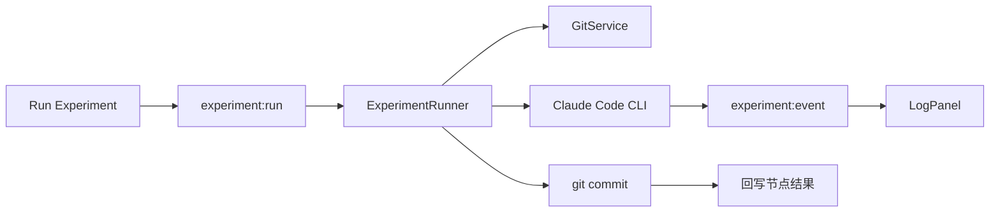

# AI-Scientist-Formulation

面向科研人员的 **灵感搜索树（IST, Idea Search Tree）** 桌面应用与相关设计文档仓库。核心理念是 **human in the loop**：由人掌握研究脉络与细节，再逐步接入自动化实验与 Agent 能力。

## 仓库结构

| 路径 | 说明 |
|------|------|
| [`idea.md`](idea.md) | 产品愿景、交互与数据模型需求（含规划中的 Agent / Git 分支等） |
| [`ist-app/`](ist-app/) | **当前可运行的桌面应用**（Electron + React） |
| [`.cursor/plans/`](.cursor/plans/) | 内部技术方案与 MVP 计划（可选阅读） |

应用源码与依赖均在 `ist-app` 子目录，请在**该目录**下安装依赖与执行脚本。

## `ist-app` 已实现能力（MVP）

- **画布**：XMind 风格树状布局（灵感节点向右展开、实验节点在父灵感节点下方排列），SVG 节点与贝塞尔连线；支持平移与缩放（`react-zoom-pan-pinch`）。
- **节点类型**：灵感节点（黄色）、实验节点（灰色）；实验节点下不可再挂子节点（与 `idea.md` 一致）。
- **编辑与交互**：点击节点在右侧详情栏编辑标题与描述；从灵感节点可新建子灵感或子实验；删除时根据是否有内容/子树弹出确认。
- **工程文件**：JSON 结构、扩展名 **`.ist`**；新建 / 打开 / 保存 / 另存为；启动时尝试恢复上次打开的文件路径。
- **快捷键**（渲染进程内）：`Cmd/Ctrl+S` 保存、`Cmd/Ctrl+Shift+S` 另存为、`Cmd/Ctrl+N` 新建、`Cmd/Ctrl+O` 打开；`Delete` / `Backspace` 删除选中节点（输入框内不触发）；`Escape` 取消选中。
- **AI（主进程调用，密钥不进入前端）**：在 **Settings** 中配置提供商（OpenAI / Anthropic）、Base URL、API Key、模型名；支持根据描述**生成标题**、对从根到当前灵感的路径及子树**一键总结**（兼容自定义 Base URL 的 OpenAI 式接口）。
- **自动化实验（Claude Code CLI）**：
  - 实验节点详情栏提供 **Run Experiment** / **Stop Experiment**；运行中在底部 **Experiment Log** 面板实时显示流式日志。
  - 主进程调用本机 **Claude Code CLI**（无头、`stream-json` 输出、prompt 经 stdin 传入），不在应用内自建 harness。
  - **一工程一 Git 工作区、一实验一分支**：工作区默认位于 `.ist` 文件同目录下的 `<项目名>-workspace`（也可在 `meta.workspacePath` 中指定相对/绝对路径）；每个实验节点对应分支 `exp/<节点短 id>`，基于父实验分支或 `main` 创建。
  - 运行结束后自动 `git commit`，并将 `gitBranch`、`experimentResult`（Agent 末段摘要）、`runStatus` 写回节点；完整轨迹落盘至工作区 `.ist-runs/<runId>/`。
  - 首次初始化工作区时，若仓库根目录存在 [`data/cal_housing.csv`](data/cal_housing.csv)，会复制到工作区 `data/` 并作为基线提交（MVP 样例数据集）。
- **Harness 配置**：在 **Settings → Experiment Harness** 中配置 CLI 命令（默认 `claude`）、可选模型、`permissionMode`（默认 `bypassPermissions`）、额外参数等；配置保存在本机 `electron-store`（`userData/settings.json`）。
- **打包**：`electron-builder` 配置 macOS（dmg / zip）、Windows（NSIS），并注册 **`.ist`** 文件关联（详见 `ist-app/electron-builder.yml`）。

## 技术栈（`ist-app`）

- **桌面**：Electron 35+，`electron-vite` 构建  
- **界面**：React 19、TypeScript、Tailwind CSS v4  
- **状态**：Zustand  
- **布局**：纯函数布局引擎 `src/layout/treeLayout.ts`，与 UI 解耦  

## 开发与运行

环境要求：**Node.js**（建议 LTS）与 **npm**。

```bash
cd ist-app
npm install
npm run dev
```

类型检查：

```bash
npm run typecheck
```

生产构建与本地预览打包产物：

```bash
npm run build
npm run preview
```

生成安装包 / 分发文件：

```bash
npm run package
```

输出目录见 `ist-app/electron-builder.yml` 中的 `directories.output`（默认 `ist-app/dist`）。

### 自动化实验前置条件

端到端跑实验需要本机已安装并完成登录的 [Claude Code CLI](https://docs.anthropic.com/en/docs/claude-code)。可用以下命令做 smoke test：

```bash
claude -p "Reply with exactly HELLO." --output-format json --tools ""
```

在应用内：新建或打开 `.ist` 工程 → 添加实验节点并填写描述（可引用 `data/cal_housing.csv`）→ **Run Experiment**。默认 CLI 形态等价于：

```bash
claude -p \
  --input-format text \
  --output-format stream-json \
  --verbose \
  --add-dir <workspace> \
  --no-session-persistence \
  --permission-mode bypassPermissions
```

（prompt 由应用写入 stdin，不进入 argv。）

## `.ist` 数据概要

工程为 JSON，主要字段包括 `version`、`rootNodeId`、`nodes`（节点字典）、`meta`（`createdAt` / `updatedAt`，可选 **`workspacePath`** 指向实验 Git 工作区）。节点含 `type`（`idea` | `experiment`）、`title`、`description`、`parentId`、`childrenIds`；实验节点还可含 **`gitBranch`**、**`experimentResult`**、**`runStatus`**（`idle` | `running` | `done` | `failed`）。类型定义见 [`ist-app/shared/types.ts`](ist-app/shared/types.ts)。

## 自动化实验架构（简述）



实现文件概览：`ist-app/electron/services/git/GitService.ts`、`ist-app/electron/services/experiment/ExperimentRunner.ts`、`ist-app/electron/ipc/experimentHandlers.ts`。详细方案见 [`.cursor/plans/ist_自动化实验_mvp_08b7ca03.plan.md`](.cursor/plans/ist_自动化实验_mvp_08b7ca03.plan.md)。

## 规划与未实现项

**撤销/重做**、命令级审批门、多 harness 切换、DeepScientist 式 MCP 注入等仍为后续项，见 [`idea.md`](idea.md)。当前 MVP 已支持：画布编辑、`.ist` 持久化、AI 辅助标题/总结、以及基于 Claude Code CLI + Git 分支的实验运行闭环。

## 许可证

见仓库根目录 [`LICENSE`](LICENSE)。
